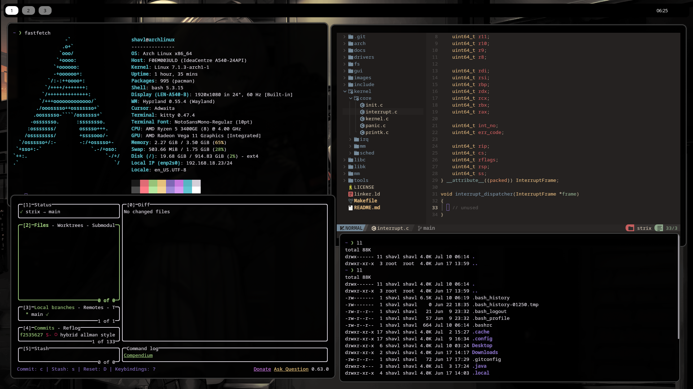
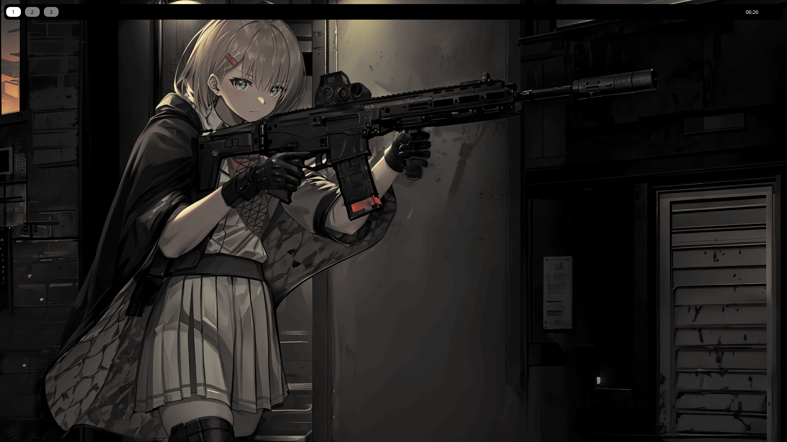

# dotfiles

Welcome to my personal dotfiles repository. Here I host and manage the configuration files for my workspace.

  
  &nbsp;
  

## Environment Details

Here is a summary of the main tools and programs I use on a daily basis:

| Component | Program / Tool |
| :--- | :--- |
| **Operating System** | [Arch linux, Debian, Fedora] |
| **Window Manager**| [i3wm, hyprland] |
| **Terminal Emulator**| [Kitty] |
| **Shell** | [Bash, Zsh] |
| **Main Editor** | [Vim, Neovim] |
| **Multiplexer** | [Tmux] |
| **Theme / Colors** | [Gruvbox, Monochromatic] |
| **Git** | [Cli, Lazygit] |
| **Font** | [JetBrains Mono Nerd Font] |
